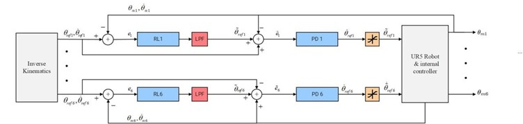

# **Reinforcement Learning-Based Compensation for UR5e Robot Control**

## **1. Project Overview**
This project implements a reinforcement learning-based compensation method for controlling the UR5e robot to achieve high tracking accuracy in following a reference trajectory, such as a square path. The robot is designed to maintain precise tracking of both fixed points and continuous paths, making it suitable for applications like rehabilitation and precise industrial operations.

### Key Features:
- **Reinforcement Learning Algorithms**: The project leverages two prominent RL algorithms, **Proximal Policy Optimization (PPO)** and **Soft Actor-Critic (SAC)**, known for their robustness and efficiency in handling high-dimensional action spaces and continuous control tasks.
- **Inverse Kinematics**: Utilized to determine the desired joint positions for each point along the target trajectory, ensuring the end-effector follows the specified path accurately.
- **Proportional-Derivative (PD) Controller**: Computes the control signals required for each joint based on the difference between the desired and actual positions, providing stability to the overall control system.
- **Reinforcement Learning Compensator**: Adjusts the reference signals dynamically in real-time to minimize tracking errors, enhancing the robot's ability to maintain precise movements.
- **Low-Pass Filter**: Applied to the RL-generated actions to reduce high-frequency noise, improving the stability and smoothness of the control signals.

The focus of this project is to simulate the UR5e robot using RL-based compensators and evaluate their performance in trajectory tracking tasks. This approach allows for adaptive adjustments to the control system, enabling smooth and precise movements even in dynamic environments.

The block diagram of the project is as follows:


---

## **2. Installation and Dependencies**
To set up this project, ensure you have the following dependencies installed:

```bash
pip install torch ray numpy gym matplotlib
```

## **3. URDF and Mesh Files**
The UR5e robot's URDF file is sourced from [this GitHub repository]([https://github.com/example-repo](https://github.com/culurciello/pybullet_ur5_gripper/blob/master/robots/urdf/ur5e.urdf)). To ensure that the URDF can find the required mesh files (STL files), place them in the following directory within your project:

```bash
/your_project_directory/ur5e/meshes/collision/
```
Ensure that the structure matches exactly, as the URDF file uses relative paths to reference these files.

---

## **4. Running the Code**
To run the simulations and evaluate the RL-based compensator's performance:

1. **Set up your environment** by ensuring all dependencies are installed and the URDF and mesh files are correctly located.
2. **Run the main script** with the appropriate parameters for the PPO or SAC algorithm, depending on the experiment you want to conduct.
3. **Output**: The code will generate plots showing the tracking performance of the robot across different episodes (PPO or SAC, based on the chosen algorithm).

---

## **5. Usage Examples**
While the code does not include rendering, the results are visualized through plots that illustrate the robot’s tracking performance in each episode. In this simulation, the robot is configured to follow a reference trajectory like a z-axis square pulse. The following plots are generated:

- **Position Error Over Time**: Displays the error between the desired and actual positions in different axes, demonstrating how the RL compensator reduces deviations.


- **End-Effector Position vs. Reference**: Shows the path followed by the end-effector compared to the target trajectory, providing insights into tracking accuracy.


- **Joint Positions in Joint-Space**: Visualizes the movement of each joint over time, highlighting the adjustments made by the RL compensator.


- **Joint Velocities**: Depicts the velocity of each joint, reflecting the smoothness of movements and responsiveness of the control system.


- **Reward Per Episode**: Illustrates the rewards obtained for each joint throughout the steps of an episode, providing an indication of learning progress.


Additionally, a CSV file is generated, capturing detailed data for each parameter.


These visual outputs demonstrate the effectiveness of RL-based compensation in reducing tracking errors compared to standard PD control methods, showcasing the improved precision and stability of the UR5e robot's movements.

---


